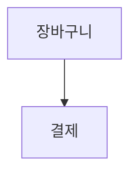

# 구현 계획 — 말그림(MalGrim) 3단계 로드맵

> 기준 문서: `docs/PRD.md`  
> 목표: 4시간 입코딩 대회에서 Azure 배포 URL로 데모 가능한 웹 앱 완성

---

## 전체 전략

말그림의 구현은 처음부터 모든 기능을 동시에 만들지 않는다. 먼저 다이어그램 생성 파이프라인을 끝까지 관통시키고, 그 위에 Copilot SDK, Azure OpenAI, Azure Speech, 내보내기 기능을 단계적으로 얹는다.

핵심 성공 경로는 다음과 같다.

```text
사용자 명령
→ 에이전트/명령 처리기
→ Diagram IR(JSON) 변경
→ Mermaid 문자열 직렬화
→ 브라우저 렌더
→ Azure 배포 URL에서 동작
```

가장 중요한 원칙은 모델이 Mermaid를 직접 만들지 않게 하는 것이다. AI는 도구 호출로 IR만 편집하고, Mermaid 생성은 결정적 직렬화기가 담당한다.

---

## 1단계 — 프로젝트 골격과 결정적 다이어그램 파이프라인

### 목표

텍스트 명령이나 샘플 데이터를 통해 다이어그램 IR이 만들어지고, Mermaid로 직렬화되어 화면에 렌더링되는 최소 웹 앱을 만든다.

이 단계에서는 음성, Copilot SDK, Azure 연동을 붙이지 않는다. 먼저 제품의 뼈대가 실제로 작동해야 한다.

### 구현 범위

- Next.js + React + TypeScript 프로젝트 스캐폴딩
- 기본 화면 구성
- Diagram IR 타입 정의
- Mermaid 직렬화기 구현
- 인메모리 세션 스토어 구현
- 기본 도구 함수 구현
- 텍스트 입력 기반 명령 처리 API 구현
- Mermaid 렌더링 UI 구현

### 생성할 주요 파일

```text
package.json
next.config.ts
tsconfig.json
.env.example
app/
  layout.tsx
  page.tsx
  globals.css
  api/
    diagram/
      route.ts
lib/
  diagram/
    types.ts
    serialize.ts
    store.ts
    resolver.ts
    tools.ts
components/
  CommandInput.tsx
  DiagramCanvas.tsx
  ToolLog.tsx
```

### 핵심 구현 내용

#### 1. Diagram IR 타입

```ts
type FlowchartIR = {
  type: "flowchart";
  direction: "TD" | "LR";
  title?: string;
  nodes: { id: string; label: string; shape?: "rect" | "round" | "diamond" }[];
  edges: { id: string; from: string; to: string; label?: string }[];
};

type SequenceIR = {
  type: "sequence";
  title?: string;
  participants: { id: string; label: string }[];
  messages: { id: string; from: string; to: string; label: string; kind?: "sync" | "async" | "return" }[];
};

type DiagramIR = FlowchartIR | SequenceIR;
```

#### 2. Mermaid 직렬화기

- `serializeDiagram(ir: DiagramIR): string` 구현
- 1차 우선순위는 플로우차트
- 시퀀스 다이어그램은 구조를 열어두되, MVP에서는 후순위 가능
- 라벨 안의 따옴표, 줄바꿈 등 Mermaid 문법을 깨는 문자는 escape 처리

예상 출력:



#### 3. 도구 함수

최소 도구:

```text
create_diagram(type, title?)
add_node(label, shape?)
connect(from, to, label?)
relabel(ref, newLabel)
remove(ref)
set_direction(dir)
clear()
```

각 도구는 다음 결과를 반환한다.

```ts
type ToolResult = {
  ir: DiagramIR | null;
  log: {
    tool: string;
    summary: string;
  };
};
```

#### 4. 텍스트 명령 MVP

초기에는 자연어 전체를 완벽히 해석하지 않아도 된다. 데모 시나리오에 필요한 대표 명령부터 처리한다.

지원할 첫 명령:

```text
주문 처리 흐름을 플로우차트로 그려줘
결제 실패 분기 추가
장바구니를 카트 확인으로 바꿔줘
왼쪽에서 오른쪽으로 보여줘
전체 지워줘
```

### 완료 기준

- 로컬에서 `npm run dev` 실행 가능
- 브라우저에서 텍스트 명령 입력 가능
- 명령 후 다이어그램이 Mermaid로 렌더링됨
- 도구 호출 로그가 화면에 표시됨
- 전체 삭제 요청 시 바로 삭제하지 않고 확인 상태를 표시할 수 있음

### 이 단계의 리스크

- Mermaid 렌더링 실패
- IR과 Mermaid 간 불일치
- 라벨 escape 누락으로 문법 오류 발생
- 스토어가 요청마다 초기화되어 상태가 유지되지 않는 문제

### 리스크 대응

- Mermaid 문자열을 화면에 함께 노출해 디버깅 가능하게 한다.
- 직렬화기 단위 테스트를 최소 2개 작성한다.
- 인메모리 스토어는 서버 모듈 싱글턴으로 시작하고, 배포 제약이 생기면 세션 id 기반으로 확장한다.

---

## 2단계 — Copilot SDK 에이전트와 Azure OpenAI 연결

### 목표

사용자 자연어 명령을 Copilot SDK 에이전트가 해석하고, 등록된 도구 호출을 통해 Diagram IR을 편집하게 만든다. Azure OpenAI는 실제 추론 경로에 포함되어야 한다.

### 구현 범위

- Copilot SDK 설치 및 기본 에이전트 구성
- 도구 함수 등록
- 현재 IR과 최근 도구 로그를 에이전트 컨텍스트로 주입
- Azure OpenAI 환경변수 구성
- 에이전트 응답 스트리밍 또는 단계별 로그 표시
- 모델 출력 검증 및 실패 시 폴백 처리

### 추가할 주요 파일

```text
lib/
  ai/
    agent.ts
    azure-openai.ts
    prompts.ts
app/
  api/
    agent/
      route.ts
```

### 환경변수

```text
AZURE_OPENAI_ENDPOINT=
AZURE_OPENAI_API_KEY=
AZURE_OPENAI_DEPLOYMENT=
AZURE_OPENAI_API_VERSION=
```

### 에이전트 운영 규칙

시스템 프롬프트의 핵심 지시:

```text
You edit diagrams only by calling tools.
Do not write Mermaid directly.
Use the current Diagram IR as source of truth.
If a user reference is ambiguous, ask a short clarification question.
For destructive actions such as clear, request confirmation first.
```

### 등록할 도구 우선순위

1차 필수:

```text
create_diagram
add_node
connect
relabel
clear
```

2차 확장:

```text
remove
set_direction
add_participant
switch_type
export
```

### Azure OpenAI 연결 전략

#### 1순위

Copilot SDK의 모델 계층이 Azure OpenAI 엔드포인트를 직접 사용할 수 있으면 그대로 연결한다.

#### 차선책

Copilot SDK와 Azure OpenAI 직접 연결이 막히면 다음 구조로 전환한다.

```text
Copilot SDK: 제품 내 도구 오케스트레이션과 에이전트 인터페이스 담당
Azure OpenAI: 자연어 명령을 구조화된 action JSON으로 변환
도구 실행: 서버가 action JSON을 검증한 뒤 IR 수정
```

이 경우에도 Azure OpenAI가 의미 있는 AI 추론에 실제로 사용되어야 한다.

### 검증 포인트

- 에이전트가 Mermaid 문자열을 직접 만들지 않는지 확인
- 도구 호출 로그가 화면에 보이는지 확인
- 없는 노드 id를 참조하는 도구 호출이 거부되는지 확인
- `clear`는 확인 전 실행되지 않는지 확인
- Azure OpenAI 키가 브라우저로 노출되지 않는지 확인

### 완료 기준

- 자연어 명령으로 플로우차트 생성 가능
- 자연어 명령으로 노드 추가, 연결, 라벨 변경 가능
- 현재 IR이 에이전트 컨텍스트에 반영됨
- Azure OpenAI 호출이 서버에서 실제로 발생함
- 도구 호출 결과가 UI 로그에 표시됨

### 이 단계의 리스크

- Copilot SDK와 Azure OpenAI 연결 방식 불확실
- 모델이 Mermaid 직접 생성을 시도함
- 자연어 참조가 잘못된 요소로 매핑됨
- 스트리밍 구현에 시간이 과도하게 들어감

### 리스크 대응

- 스트리밍은 필수 기능이 아니라 점진 로그로 대체 가능하게 설계한다.
- 라벨 리졸버는 정확 일치, 부분 일치, 최근 변경 요소 순으로 단순하게 시작한다.
- Azure OpenAI 연결이 막히면 action JSON 변환 API로 즉시 전환한다.

---

## 3단계 — 음성 입력, 내보내기, Azure 배포와 데모 완성

### 목표

Azure 배포 URL에서 실제 사용자가 음성 또는 텍스트로 다이어그램을 만들고 수정할 수 있게 한다. 심사용 데모 시나리오를 안정적으로 수행할 수 있어야 한다.

### 구현 범위

- Azure Speech-to-Text 브라우저 입력
- 텍스트 폴백 유지
- Mermaid 텍스트 복사 및 다운로드
- SVG 또는 PNG 내보내기
- 삭제 확인 UI
- Dockerfile 작성
- Azure Container Apps 배포
- 환경변수/시크릿 설정
- 스모크 테스트 및 데모 리허설

### 추가할 주요 파일

```text
Dockerfile
.dockerignore
components/
  VoiceInput.tsx
  ExportButtons.tsx
app/
  api/
    speech-token/
      route.ts
```

### Azure 리소스

필수:

```text
Azure OpenAI
Azure AI Speech
Azure Container Apps
Azure Key Vault 또는 Container Apps secrets
```

권장:

```text
Azure Container Registry
Log Analytics Workspace
Application Insights
Azure Monitor
```

### 환경변수

```text
AZURE_OPENAI_ENDPOINT=
AZURE_OPENAI_API_KEY=
AZURE_OPENAI_DEPLOYMENT=
AZURE_OPENAI_API_VERSION=
AZURE_SPEECH_KEY=
AZURE_SPEECH_REGION=
NEXT_PUBLIC_APP_URL=
```

브라우저에는 장기 키를 직접 내려보내지 않는다. 가능하면 서버의 `api/speech-token`에서 짧은 수명의 Speech 토큰을 발급한다.

### 내보내기 우선순위

1. Mermaid 텍스트 복사
2. `.mmd` 파일 다운로드
3. SVG 다운로드
4. PNG 다운로드

PNG 구현이 오래 걸리면 SVG 다운로드로 제출한다. PRD에서 PNG(SVG)를 허용하고 있으므로 데모 완주를 우선한다.

### 데모 시나리오

최소 데모:

```text
1. "온라인 쇼핑몰 주문 처리 흐름을 플로우차트로 그려줘"
2. "결제 실패 분기를 추가해줘"
3. "장바구니를 카트 확인으로 바꿔줘"
4. "Mermaid로 내보내줘"
5. "전체 지워줘"
6. 삭제 확인 UI 표시 후 승인
```

확장 데모:

```text
1. "이걸 시퀀스 다이어그램으로 바꿔줘"
2. "PNG로 내보내줘"
3. 음성 입력만으로 전체 시나리오 진행
```

### 배포 절차

```text
1. 로컬에서 npm run build 확인
2. Docker 이미지 빌드
3. Azure Container Registry에 이미지 push
4. Azure Container Apps 생성 또는 업데이트
5. OpenAI/Speech 관련 secret 주입
6. 배포 URL 접속
7. 텍스트 명령 스모크 테스트
8. 음성 입력 스모크 테스트
9. 내보내기 테스트
10. 데모 스크립트 리허설
```

### 완료 기준

- Azure URL에서 앱 접속 가능
- 텍스트 명령으로 플로우차트 생성 및 수정 가능
- 음성 입력이 성공하거나, 실패 시 텍스트 폴백으로 즉시 진행 가능
- Mermaid 렌더가 깨지지 않음
- 도구 호출 로그가 표시됨
- 삭제 확인 UI가 동작함
- Mermaid 텍스트 또는 SVG 내보내기가 동작함
- OpenAI/Speech 키가 저장소와 브라우저 번들에 노출되지 않음

### 이 단계의 리스크

- Speech 인식이 데모 환경 소음에 취약함
- Container Apps 환경변수 누락
- Docker 빌드 실패
- Azure 리소스 권한 문제
- PNG 내보내기 구현 지연

### 리스크 대응

- 텍스트 폴백을 항상 화면에 노출한다.
- 배포 전 `.env.example`과 Container Apps secrets를 대조한다.
- PNG가 막히면 SVG와 Mermaid 텍스트 내보내기로 대체한다.
- Azure 배포 전에 로컬 Docker 실행을 반드시 확인한다.

---

## 단계별 우선순위 요약

| 단계 | 반드시 끝낼 것 | 포기 가능/후순위 |
|---|---|---|
| 1단계 | IR, 도구 함수, Mermaid 렌더, 텍스트 명령 | 시퀀스 다이어그램, 고급 UI |
| 2단계 | Copilot SDK 도구 호출, Azure OpenAI 추론 | 완전한 스트리밍, 복잡한 참조 해석 |
| 3단계 | Azure 배포, Speech 또는 텍스트 폴백, 내보내기 | PNG, 타입 전환, Application Insights |

---

## 최종 컷라인

시간이 부족할 때 반드시 지켜야 하는 최소 제출 기준은 다음이다.

```text
Azure 배포 URL
+ 텍스트 명령 입력
+ Azure OpenAI 또는 Copilot SDK 기반 명령 해석
+ Diagram IR 편집
+ Mermaid 렌더
+ 도구 호출 로그
+ Mermaid 텍스트 내보내기
```

음성 입력, 시퀀스 다이어그램, 타입 전환, PNG 다운로드는 강력한 가산점이지만, 위 최소 기준보다 우선하지 않는다.
